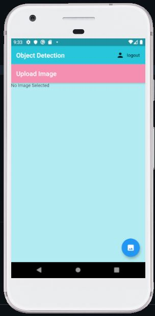

# flutter-firebase-Object-Detection-App

- Flutter app integrated with Firebase auth service for user's authentication and allow user to register/signin with email and password.

- This app using TFLite with Tiny Yolov2 and SSD models to perform object detection.

 
