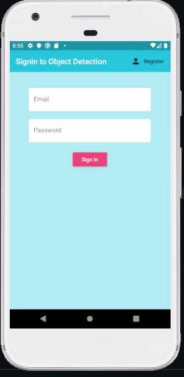

# flutter-firebase-Object-Detection-App

- Flutter app integrated with Firebase auth service for user's authentication

- This app using TFLite with Tiny Yolov2 and SSD models to perform object detection

- To use the app clone the repo and connect to firebase using your credential and upload the google-services.json file in android/app folder.

